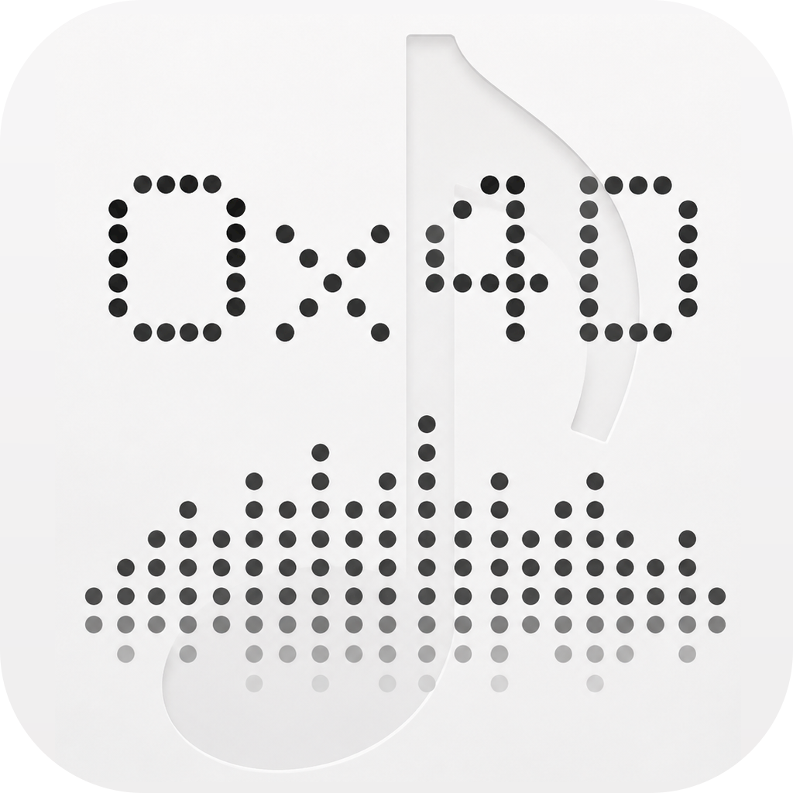
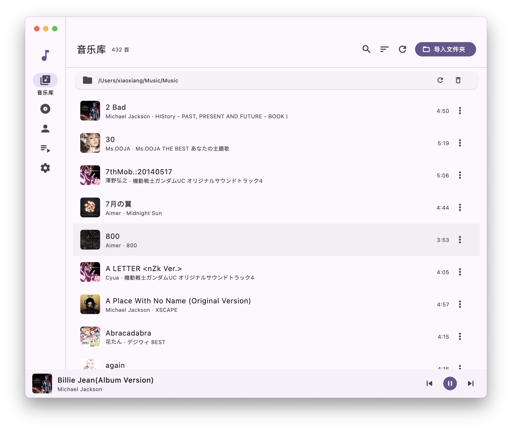

# 0x4D Music Player

A local music player built with **Flutter**.

<p align="center">
  
  <br/>
  
</p>

## Features

- **Local music library** — pick a folder, scan your files, and parse embedded metadata (title, artist, album artist, album, track, disc, duration, year, genre, bitrate, sample rate, cover art). A file watcher keeps the library in sync when files change; removing a folder also cleans up orphaned albums and artists.
- **Albums & Artists** — browse by grid, open dedicated detail pages (album pages group tracks by disc), and hit "play all".
- **Playlists** — create / rename / delete playlists, add songs from the library, drag to reorder, import / export **M3U8**, plus a built-in **Favorites** view.
- **In-page search** — live filtering with match counts across Library, Albums, Artists and Playlists.
- **Playback queue** — play next, reorder, repeat modes and shuffle, with the queue, repeat/shuffle state and playback position persisted across restarts.
- **Hi-Res audio** — playback via `audioplayers`, including lossless formats like FLAC.
- **Lyrics** — synced `.lrc` lyrics on the Now Playing page, auto-detected next to the audio file, with bilingual (e.g. Chinese-Japanese) line splitting and adjustable text size.
- **System media controls** (macOS) — lock-screen / media-key controls (play, pause, next, previous, seek) with Now Playing metadata and cover art; dock menu and window restore after close.
- **Smart sorting** — pinyin and Japanese kana based sort keys for natural ordering in the library.
- **Cover art caching** — album art is extracted once and cached for fast browsing.
- **Volume & favorites** — persistent volume control and a favorites toggle on the player bar.
- **Logging & error handling** — leveled file logs with a built-in viewer, a startup error page, and graceful playback-error handling (auto-skip with a retry limit).

### Planned

- Multiple Display Language Support
- Gapless playback
- DSD support
- Windows / Linux system media controls

## Getting Started

### Prerequisites

- Flutter SDK (Dart `^3.12`) — see [flutter.dev](https://flutter.dev)
- macOS is currently the primary target (full media-control integration)

### Build & Run

```bash
flutter pub get
flutter run -d macos
```

> Editing anything under `macos/` (Swift / native code) requires a native rebuild: quit the
> app, delete `build/macos`, then run again — hot reload and hot restart do not recompile
> Swift. **Do not run `flutter clean`** in this project: it hangs on the SQLite native
> assets built through Swift Package Manager.

### macOS permissions

Music folders inside `~/Music` are protected by the **Media & Apple Music** privacy setting.
`NSOpenPanel` + security-scoped bookmarks only grant *Files and Folders* access, so a library
stored there still fails with `Operation not permitted` (errno 1) on the first scan.
Fix it once per machine:

1. Open **System Settings → Privacy & Security → Media & Apple Music**
2. Add `0x4D.app` with the `+` button and leave it enabled
3. Scan again — the library loads normally

## Project Structure

Feature-oriented layout — shared infrastructure in `core/`, business features in `features/`, reusable widgets in `widgets/`.

```
lib/
├── app/          # app configuration, routing, themes
├── core/         # audio, database, services, utils, constants
├── features/     # library, album, artist, playlist, player, settings, shell
├── models/       # application models
└── widgets/      # reusable UI components
```

See [docs/Architecture.md](docs/Architecture.md) for the full architecture and [docs/Rules.md](docs/Rules.md) for development conventions.

## Tech Stack

- **Flutter / Dart**
- **drift** — SQLite ORM for the local library database
- **audioplayers** — audio playback (single-track; queue logic lives in the app)
- **audio_metadata_reader** — metadata & embedded cover art parsing (pure Dart; uses the [cxx1234 fork](https://github.com/cxx1234/audio_metadata_reader) pinned to commit `4a6f245` for `albumArtist` + embedded lyrics support)
- **flutter_lyric** — `.lrc` lyric rendering
- **file_picker / watcher** — folder selection & library change watching
- **lpinyin** — pinyin sort keys

## Testing

```bash
flutter test
```

## License

[MIT](LICENSE) © 2026 Jerry C