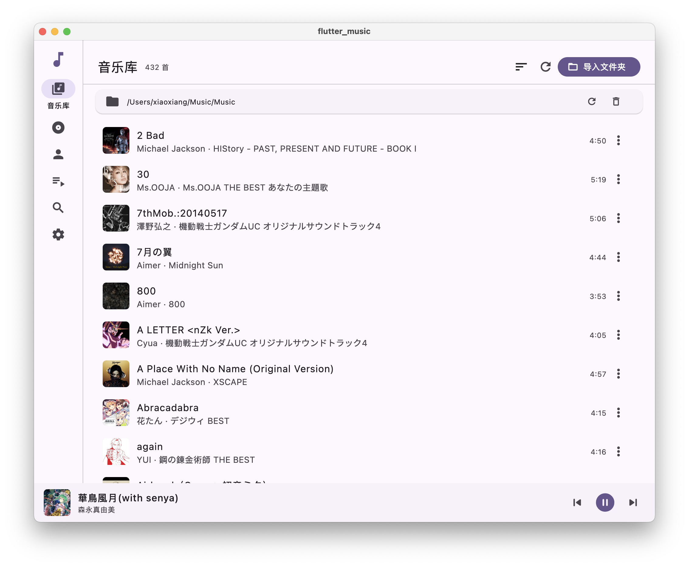

# Flutter Music

A local music player built with **Flutter**.

<p align="center">
  
</p>

## Features

- **Local music library** — pick a folder, scan your files, and parse embedded metadata (title, artist, album, track, disc, duration, year, genre, cover art). A file watcher keeps the library in sync when files change.
- **Albums & Artists** — browse by grid, open dedicated detail pages, and hit "play all".
- **Playlists** — create / rename / delete playlists, add songs from the library, drag to reorder, plus a built-in **Favorites** view.
- **Playback queue** — play next, reorder, repeat modes and shuffle, with the queue persisted across restarts.
- **Hi-Res audio** — playback via `just_audio`, including lossless formats like FLAC.
- **In-file lyrics** — lyrics panel on the Now Playing page.
- **System media controls** (macOS) — lock-screen / media-key controls (play, pause, next, previous, seek) with Now Playing metadata and cover art.
- **Smart sorting** — pinyin and Japanese kana based sort keys for natural ordering in the library.
- **Cover art caching** — album art is extracted once and cached for fast browsing.

### Planned

- Gapless playback
- DSD support

## Getting Started

### Prerequisites

- Flutter SDK (Dart `^3.12`) — see [flutter.dev](https://flutter.dev)
- macOS is currently the primary target (full media-control integration)

### Build & Run

```bash
flutter pub get
flutter run -d macos
```

## Project Structure

Feature-oriented layout — shared infrastructure in `core/`, business features in `features/`, reusable widgets in `widgets/`.

```
lib/
├── app/          # app configuration, routing, themes
├── core/         # audio, database, services, utils, constants
├── features/     # library, album, artist, playlist, player, settings, shell
├── models/       # application models
└── widgets/      # reusable UI components
```

See [docs/Architecture.md](docs/Architecture.md) for the full architecture and [docs/Rules.md](docs/Rules.md) for development conventions.

## Tech Stack

- **Flutter / Dart**
- **drift** — SQLite ORM for the local library database
- **just_audio** — audio playback
- **audio_metadata_reader** — metadata & embedded cover art parsing (pure Dart)
- **file_picker / watcher** — folder selection & library change watching
- **lpinyin** — pinyin sort keys

## Testing

```bash
flutter test
```

## License

[MIT](LICENSE) © 2026 Jerry C